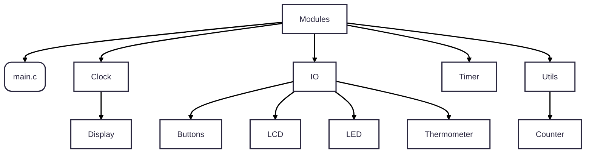

# HCS12 Source Code Code

Modules

## [Main](main.c)

Main function. Program entry point.

## [Clock](Clock/readme.md)

Configure Clock.

### [Clock Configuration Header](Clock/readme.md#clock-configuration-header)

### [Clock Code Implementation](Clock/readme.md#clock-code-implementation)

### [Display](Clock/Display/readme.md)

#### [Time Render](Clock/Display/readme.md#time-render)

#### [Title Render](Clock/Display/readme.md#title-render)

## [IO: Input Output Peripherals](IO/readme.md)

IO Drivers Interface and Abstracted Functionalities.

### [Buttons](IO/Buttons/readme.md)

Buttons Interface with a `BUTTONS_CALLBACK_REGISTRAR` to bind callbacks to a specific button press.

### [LCD](IO/LCD/readme.md)

LCD Driver Interface to interact with the LCD Screen Device `initialize/write`

### [LED](IO/LED/readme.md)

Functions abstraction to change the LED state.

### [Thermometer](IO/Thermometer/readme.md)

Defines a way to use AC-DC converting unit to poll and encode temperature as a signed 16-bit integer value.

## [Software Utilities](Utils/readme.md)

Software Abstractions.

### [Counter](Utils/Counter/readme.md)

Object like structure that binds a callback to a countdown which is triggered once counter hits zero.

## [Timer](Timer/readme.md)

Defines the timer interrupt using the Enhanced Capture Timer Unit.
