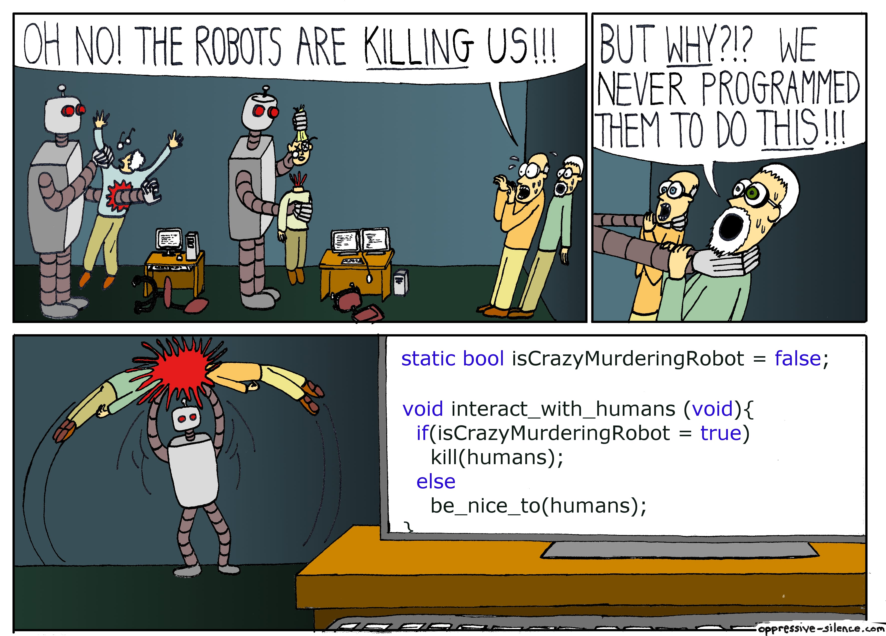

# Attempting HCS12 Clock on Dragon12 Board

Using a next task scheduling queue and periodic polling timers and even a semaphore

## [Lab2](Lab2)

Contains most stable versions with two examples written in Assembly and in C.

### [Lab2-Assembly](Lab2/Lab2-Assembly)

Current Lab2 progress written in assembly. With no C in sight.

### [Lab2-C](Lab2/Lab2-C)

Almost everything in C. Except the [lcd.asm](Lab2/Lab2-C/Sources/lcd.asm)!

> Do have a driver written in C for the LCD driver. And even worked in SIM.
>
> But won't ever run it hardware! Or publish it.
>
> Don't want to test out how idiot proof the LCD screen device actually is!

## Disclaimers

- Passed some tests on hardware!

- Buttons are a little iffy. Might need to set the different polling rate.

- This Code is an example of what the Germans call `UNFUG`.
